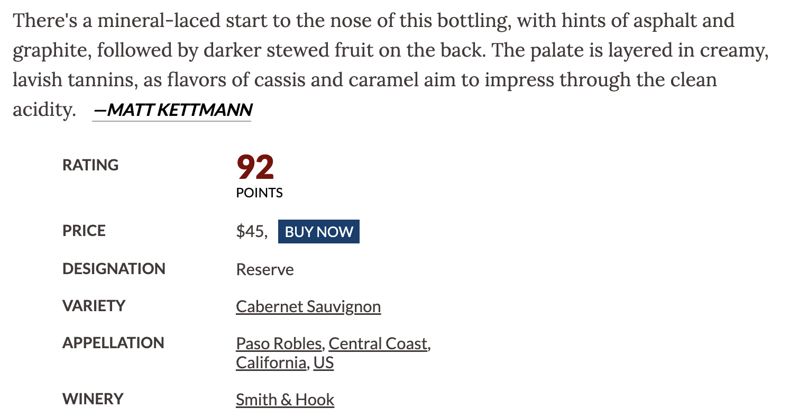
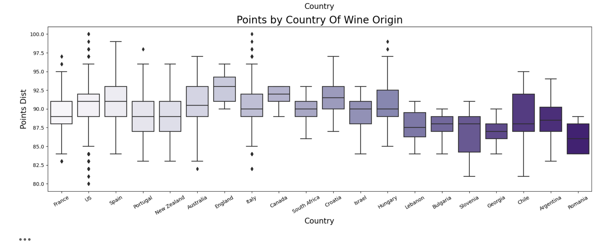
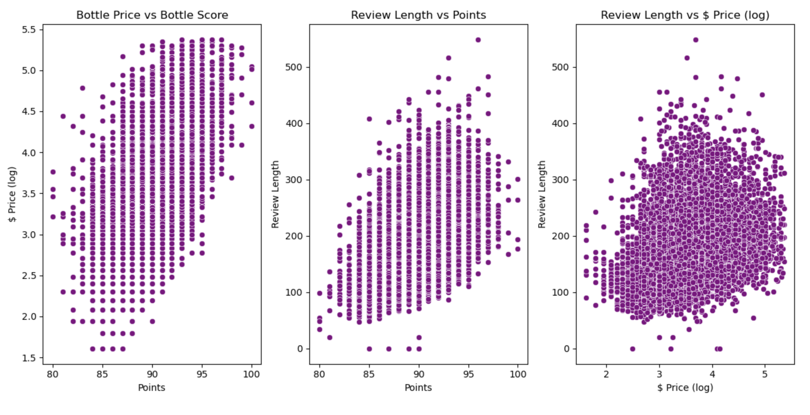
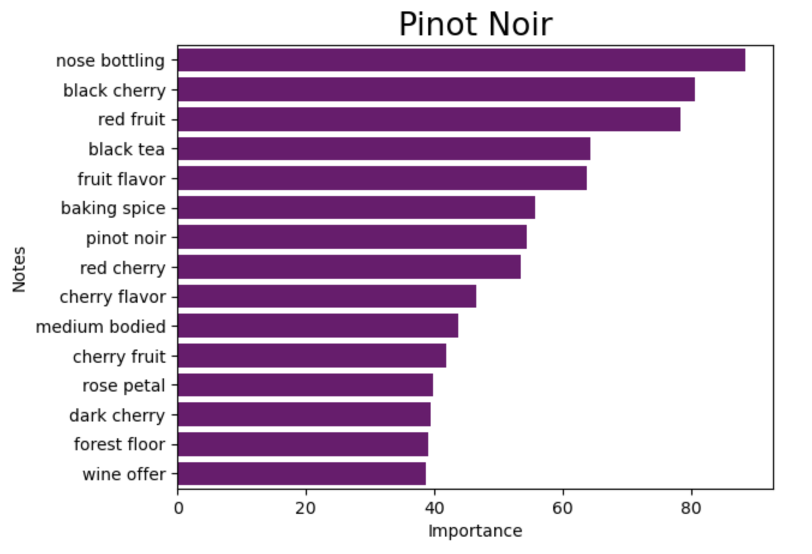
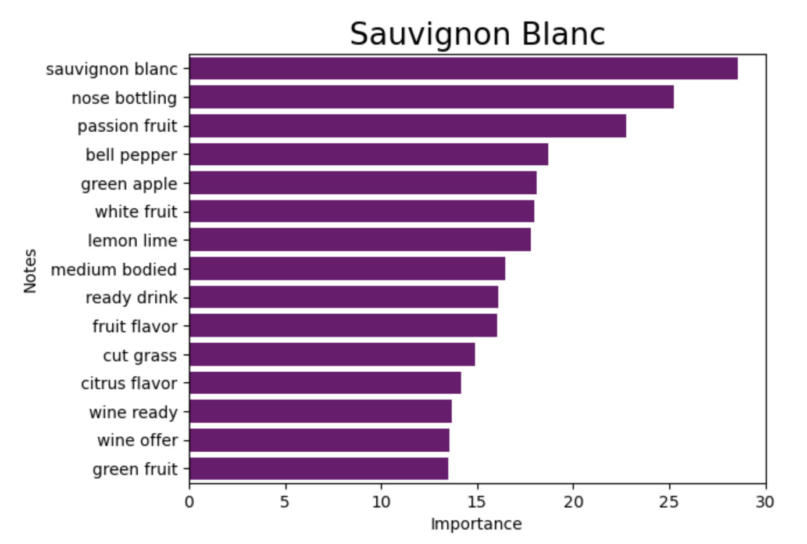
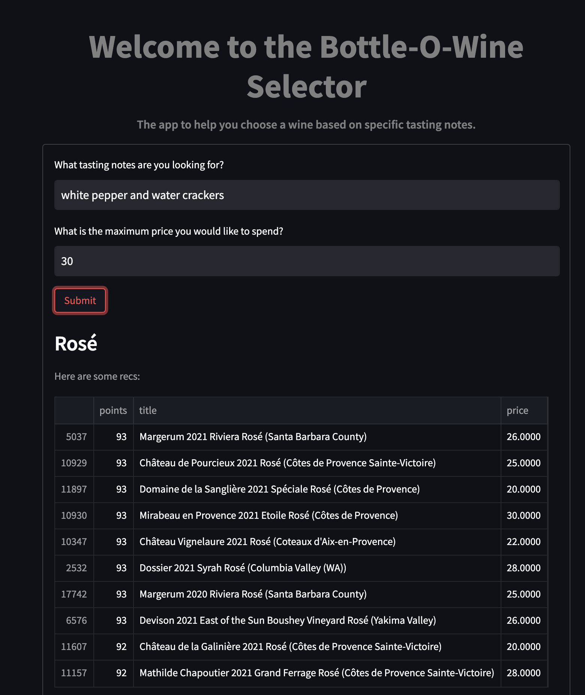

## **Capstone: Sommeliers and BERT: Grape Variety Classification** ##
## **DSI 1010 - Frank Novak**
------------------
## Repo Folder Organization
|Folder|Type|Description|
|---|---|---|
|data|folder|contains the raw and cleaned datasets used for modeling |
|0_collection|jupyter notebook|contains jupyter lab notebook with data collection via scrapewine.py|
|1_preprocessing_EDA|jupyter notebook|contains jupyter lab notebook with preprocessing, EDA and data visualization|
|2_modeling|jupyter notebook|contains jupyter lab notebook modeling and conclusions|
|README.md|README|README file for capstone|
|Sommeliers_and_BERT:Grape_Variety_Classification.pdf|pdf|pdf of presentation slides|
|Pipfile|txt|pipfile used to establish virtual environment|

## Data
- The dataset was scraped from the winemag.com website using Zack Thoutt's scrapewine script to retrieve 20,000+ reviews. [Source](https://github.com/zackthoutt/wine-deep-learning/blob/master/scrape-winemag.py)

## Software
Jupyter Labs was used to house and run our Python notebooks. Google Colab was used to run neural net models due to the ability for GPU usage for model fitting. In addition, the following libraries were imported for use:
* BeautifulSoup
* json
* pandas
* numpy
* scipy
* sklearn
* matplotlib
* missingno 
* contractions
* re
* NLTK
* gensim
* imblearn
* keras/tensorflow

## Problem Statement
- Can Sommelier reviews be used as predictive features for a multiclass classification model to distinguish specific grape varieties as a means to educate those new to wine and facilitate growth as a wine consumer?

## Data Dictionary
- *Points*: the number of points WineEnthusiast rated the wine on a scale of 1-100
- *Old World*: binary classification of wine type based on region
- *Title*: the title of the wine review
- *Variety*: the type of grapes used 
- *Description*: a few sentences from a sommelier describing the wine's taste, smell, look, feel, etc.
- *Country*: the country that the wine is from
- *Province*: the province or state that the wine is from
- *Region 1*: the wine growing area in a province or state (ie Napa)
- *Region 2*: sometimes there are more specific regions specified within a wine growing area (ie Rutherford inside the Napa Valley), but this value can sometimes be blank
- *Winery*: the winery that made the wine
- *Designation*: the vineyard within the winery 
- *Price*: the cost for a bottle of the wine 
- *Taster Name*: name of the person who tasted and reviewed the wine
- *Taster Twitter Handle*: Twitter handle for the person who tested and reviewed the wine

## Executive Summary
## Data Scraped
- Using Zackthoutt's WineEnthusiast Web Scraper, collected all wine reviews for the year 2022 on January 4, 2023. This is done by the 'scrapewinemag' import and calling the Scraper class. I specified the year and the total range of review pages (1,3047). Completed the scrape over 7 iterations due errors caused by missing entries on the website. These were saved in separate JSON files and concatenated to create the raw data frame used for modeling and analysis. A total of 23531 reviews for the 2022.

## Data Cleaned
- Data was read in from the combined JSON files from the previous step. Twitter handles and taster photos were removed because of irrelevance. Basic descriptive statistics are reviewed for outliers and total unique values for each category. There is a significant outlier in the price column and will be addressed for more accurate EDA. Duplicate wine titles are dropped. 
- The reviews are full of \n characters and unwanted punctuation for modeling. To prepare the data for further EDA and modeling, the words need to be standardized,contractions removed, cleaned up, tokenized, and lemmatized. This is soley for TFID vectorization as it needs preprocessed tokens to work correctly. Other models have built processing before vectorization. 
## Data Explored
- The majority of the wine data was not relevant to the problem at hand so EDA completed was to find interesting wines and regions. Some of the highest rated wines under $20 were made in Spain from Tempranillo grapes. Another high scoriing region typically over looked when it comes to wine was found in Hungary. 

## Text Explored
- Since modeling was based on the assumption that the classification is possible through text, there needed to be significant information found within the reviews. TFID vectorizor was used to separate words that were specific to grape varieties. As seen in the graphs, there is plenty of information found that could be used as features within the classifaction model. 

## Modeling
- For modeling, I will only be using the sommelier's reviews to predict wine variety. Seen in the wine description EDA, TDIF vocabularies and Word2Vec word similarities show significant information and are capable of being a predictive feature for modeling variety. Because of the large range of varieties, I will simplify the target variables based on specific grape varieties, excluding blends, and only choosing varieties that have at least 700 samples.
#### Naive Bayes 
* The basic model will be Multinomial Naive Bayes. This model uses Bayes Theorem of Probability which calculates the probability of an event occurring based on the prior knowledge of conditions. This modeling type is typically used for NLP classification due for simple, fast, and efficient computing power. This will be compared to Neural Nets to show if a larger pre-trained model will improve classification accuracy.
* The Term Frequency Inverse Document Frequency (TFID) vectorizer to transform text into a vector that can actually be interpreted by the model. The text is counted, indexed, and based on the frequency and inverse document frequency of the word over the entire range of documents, is converted to a vector. All stop words are removed since these tend to not relate to the important context of each document.
#### Sequential RNN
- In this model, text will again be vectorized but instead with Keras.text and a sequential recurrent neural net model. Each description is standardized (lowercased and punctuation removed), split,  recombined as ngrams, indexed, and vectorized. This model is strictly bound by the words within the data corpus. This is limited in the scope and contextual relation. 
- Once vectorized, the embedding layer takes the integer-encoded vocabulary and looks up the embedding vector for each word-index. These vectors are learned as the model trains. Then the vectors are fed through an LSTM layer, Dense, and Dropout layers. This model under performs to the Naive Bayes due to the limited context of the vocabulary and vector relations. Using the BERT model is intended to help by adding a larger and more complex vocabulary in terms of vocabulary depth, word relationships, and the resulting vectors. 
#### BERT
- BERT, Bidirectional Encoder Representations from Transformers, is Google's pretrained transformer model that has a variety of NLP applications. Trained on over 3,300 million words it is better equipped to understand contextual relationships during embedding. Using raw text as input, BERT's transformer will pre-process and encode through its pre-trained library. This model has been nicely ported in Keras for use as a fine-tuned model like classifying wine varieties. 
- To further increase the performance of the model, an optimizer scheduler was used to decay the learning rate of the model over the training time. This is done using the PolynomialDecay and applying it through the Adam optimizer. 
## App 
- Screenshots of the app being used (the app could not be deployed due to the large size of the Bert Model)

## Conclusions & Next Steps
- Overall, the BERT model increased accuracy by almost 10% from the Naive Bayes at a trade off of an exponential increase in computing power and total memory needed to store the model for deployment. This was a great exercise but would definitely improve with more data. Ideally, all 400+ types of grapes could be identified and classified based on reviews but it is beyond the scope and time constraints of the project. 
- Adding even more data and improved text preprocessing could also help in the classification. Some data leakage occurred since names of the grapes were mentioned within the review. Being able to remove this and focus on specific defining characteristics would help improve performance. 
- Other routes I would like to take: trying out different pre-trained models that may be better suited for this type of dataset, using clustering of grape varieties instead of specific for classification may produce interesting results. Add additional features like grape color (red, white, orange)would help distinguish varieties but also be used for filtering for app usage. 

## Sources
- Wine Data [Source](https://www.winemag.com/)
- Text Scraper [Source](https://github.com/zackthoutt/wine-deep-learning)
- Word2Vec Understanding [Source](https://jalammar.github.io/illustrated-word2vec/)
- Bert Understanding [Source](https://jalammar.github.io/illustrated-bert/)
- NLP Understanding [Source](https://towardsdatascience.com/text-classification-with-nlp-tf-idf-vs-word2vec-vs-bert-41ff868d1794)
